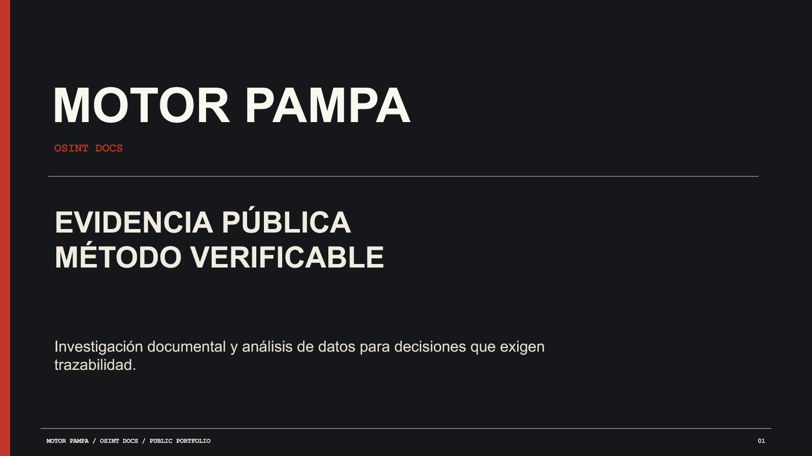

# MOTOR PAMPA

### Reconstrucciones documentales y análisis de datos que se pueden revisar desde la fuente.

Investigación documental OSINT, auditoría de datos y análisis técnico-probatorio en Argentina. Llegamos a contratos, expedientes, bases y archivos originales; reconstruimos cadenas societarias y administrativas; calculamos indicadores propios. Cada conclusión vuelve a su fuente, su método y su fecha de corte.

**[Ver capacidades demostradas](CAPACIDADES.md) · [Abrir las siete investigaciones](investigaciones/README.md) · [Explorar cuatro pilotos](comercial/PILOTOS.md) · [Leer el método](metodologia/METODO.md) · [Abrir la presentación](presentacion/Motor_Pampa_Research_2026-09-23.pptx)**

## No son sólo búsquedas OSINT

El trabajo público permite seguir una **cadena contractual y societaria internacional** hasta sus instrumentos originales; examinar técnicamente un PDF regulatorio; reconstruir un legajo electoral sin convertir indicios en hechos; recalcular proporciones sobre **62.311 solicitudes de acceso a la información**; comparar dos cortes de expedientes IOSFA y definir qué registros internos habría que preservar; y producir **estadística propia** sobre suicidios contrastando sistemas que no miden lo mismo. También auditamos un dossier previo hasta encontrar y corregir filtros demasiado amplios, cobertura incompleta y una cifra simulada.

La [matriz de capacidades demostradas](CAPACIDADES.md) enlaza cada operación con su caso y aclara qué fue ejecutado y qué es un protocolo preparado para una diligencia futura. Para una revisión técnica rápida: [Cannava](investigaciones/cannava.md) (documentos y derechos), [Acceso a la información](investigaciones/acceso-informacion.md) (base y denominadores), [IOSFA](investigaciones/iosfa.md) (serie y arquitectura probatoria) y [Suicidios](investigaciones/suicidios.md) (cálculos y comparabilidad).

## El problema que resolvemos

Un contrato aparece en un registro, una sociedad cambia de nombre en otro, una estadística usa un denominador distinto y una nota los une en una sola historia. La pregunta difícil no es sólo *qué encontramos*, sino **qué documento prueba cada tramo y cuál es el límite de esa prueba**.

Motor Pampa ordena ese trabajo para estudios jurídicos, equipos de compliance, redacciones, organizaciones de salud y políticas públicas. No vende una conclusión predeterminada: entrega el mapa para tomar una decisión mejor informada.

| Si necesitás… | Te entregamos… |
|---|---|
| Saber si una hipótesis se sostiene | Cronología, matriz de afirmaciones, fuentes y vacíos |
| Reconstruir una cadena de contratos o sociedades | Instrumentos primarios, mapa de partes y derechos, cambios de control y eslabones documentales faltantes |
| Comprobar un informe antes de usarlo | Auditoría de fuentes, filtros, código y cifras; correcciones y límites publicables |
| Revisar un corpus sin perder versiones | Índice, hashes, procedencia y bitácora de un data room |
| Usar una cifra pública con confianza | Base depurada, tasas y estimaciones propias, pruebas de sensibilidad, código y límites |
| Documentar una mora informativa | Tasas comparables por sujeto y cohorte, recorrido administrativo y anexos para reclamos o revisión jurídica |
| Detectar cambios relevantes | Observatorio de fuentes con alertas justificadas |
| Preparar registros digitales para una controversia o auditoría | Plan de preservación, inventario de sistemas, cotejo de versiones y lotes, controles de integridad e informe técnico para revisión jurídica o pericial, según los materiales disponibles |

Esta última línea puede servir de insumo en un litigio, pero **no equivale por sí sola a una pericia judicial ni garantiza admisibilidad**. El acceso a sistemas, la custodia y las diligencias formales se acuerdan con quien tenga competencia y autorización.

## La prueba está a la vista

Estas páginas son una edición pública del trabajo; enlazan originales en sus custodios y no vuelcan el archivo interno completo.

| Investigación | Lo que permite examinar |
|---|---|
| [Cerimedo](investigaciones/cerimedo.md) | Dictamen CNE, registro FARA y avisos societarios: cronología político-electoral, vínculos documentados, afirmaciones retiradas y piezas aún necesarias para cerrar contratación y pagos. |
| [Cannava](investigaciones/cannava.md) | Contrato original Cannava–PNTV, exhibits SEC, SPA regulatorio CSE y boletines: reconstrucción societaria BBV–SATIN–Blueberries y dos rutas de derechos aún no unidas por un instrumento público. |
| [Acceso a la información](investigaciones/acceso-informacion.md) | 62.311 solicitudes y 4.451 reclamos: proporciones de vencimiento por sujeto obligado, circuitos de demora y una base para preparar reclamos y litigios con el expediente individual. |
| [Suicidios](investigaciones/suicidios.md) | Serie 2005–2024, cálculos propios de tasas y cambios, y contraste crítico de DEIS, SNIC, SNVS y MPA sin duplicar hechos ni exponer personas. |
| [IOSFA](investigaciones/iosfa.md) | Dos cortes administrativos y un protocolo técnico para preservar logs, cotejar migraciones y documentar qué prueba faltaría para evaluar continuidad prestacional. |
| [Auditoría de un observatorio sectorial](investigaciones/observatorio-cannis.md) | Revisión adversarial de un dossier: proxies temáticos, objetos no recuperados, cifras simuladas y cronología normativa corregida. |
| [Mapa científico e institucional](investigaciones/cannabis-ciencia.md) | Once capas de ciencia, ensayos, regulación, compras y territorio; 214 publicaciones candidatas y 121 instituciones argentinas identificadas por metadatos, con brechas de enlace documentadas. |

Los [tres casos demostrativos](casos/) muestran el formato de entrega sin publicar material sensible. La [matriz de capacidades](CAPACIDADES.md) permite revisar técnicas y resultados por separado.

## Empezar con una pregunta, no con un contrato enorme

Esto es un servicio de investigación contratado por un equipo que necesita decidir, publicar, auditar o preparar una controversia; **no es una solicitud de financiamiento para una idea**. Los [cuatro modelos de piloto](comercial/PILOTOS.md) fijan alcance, plazo, entregables, aceptación y precio orientativo. El punto de entrada más simple es un [Evidence Sprint](comercial/pilotos/01-evidence-sprint.md): una pregunta cerrada, búsqueda delimitada y un memo que muestra qué se puede sostener hoy y qué diligencia conviene hacer después. También hay [auditoría de datos](comercial/pilotos/02-auditoria-datos.md), [Data Room](comercial/pilotos/03-data-room.md) y [observatorio](comercial/pilotos/04-observatorio.md).

El [análisis técnico-probatorio](comercial/SERVICIOS.md#análisis-técnico-probatorio) se encuadra como proyecto a medida: depende de los sistemas, custodios, registros disponibles y finalidad procesal o de auditoría. No se le asigna un precio estándar sin revisar esos extremos.

Para encuadrar un proyecto hacen falta cinco datos: **pregunta, decisión que depende de ella, fuentes conocidas, plazo y restricciones de privacidad**. Con eso se define un brief y una cotización escrita. La [presentación](presentacion/README.md) y las [fichas de servicio](comercial/SERVICIOS.md) sirven para circular internamente antes de una reunión.

## Cómo sostenemos una afirmación

1. Fijamos universo, fecha de corte y criterio de cierre.
2. Conservamos procedencia, versión, enlace y, cuando corresponde, huella de integridad.
3. Contrastamos fuentes y registramos hipótesis alternativas.
4. Entregamos una matriz donde se distingue hecho probado `[A]`, inferencia `[B]`, indicio `[C]` y búsqueda sin resultado `[NEG]`.

La [metodología](metodologia/METODO.md), el [esquema de evidencia](metodologia/ESQUEMA_EVIDENCIA.md) y los [controles de calidad](metodologia/CONTROL_DE_CALIDAD.md) detallan el proceso. Una ausencia documentada no demuestra que un acto nunca haya existido.

## Contacto y cuidado

Para un primer contacto público, podés [abrir un issue de encuadre](https://github.com/pat031-prog/motor-pampa-research/issues/new) **sin nombres propios, datos personales ni adjuntos**. Si llegaste por una presentación o correo, respondé por ese mismo canal. El intercambio de material reservado se acuerda después de evaluar el riesgo; GitHub no es un buzón para filtraciones.

Este portafolio sigue las [salvaguardas de privacidad y publicación](salvaguardas/ETICA_Y_PUBLICACION.md). No ofrece acceso no autorizado, vigilancia personal, asesoramiento legal ni diagnósticos clínicos.

---

**Motor Pampa · práctica independiente · edición pública 2026-09-23.** Cada investigación declara su propio corte. Publicar el repositorio no concede licencia de reutilización del contenido: ver [LICENSE.md](LICENSE.md).
